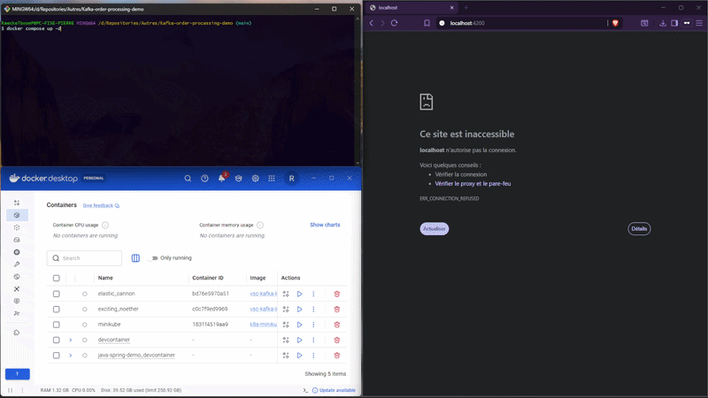
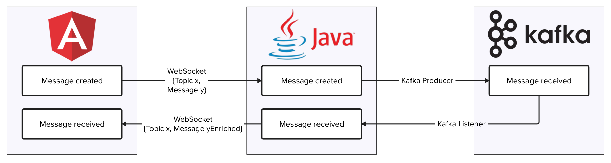

# Kafka order processing demo
Event-driven order processing system using Kafka, WebSocket and hexagonal architecture.

This project use **Java 21**, **Angular 20**, **Kafka**, **DevContainer** and **Docker**.

## Quick demo


## Architecture

- Java application (hexagonal architecture, kafka producer and consumer)
- Kafka broker
- Angular application (shows Java messages)

### Simplified flow
- Order creation event sent from the frontend
- Backend create the order event
- Event sent to Kafka
- Asynchronous processing
- Status updates streamed via WebSocket

To test Kafka's capabilities, the Angular application will have one button to create an order, a list of orders and their status.

The backend will receive the order and create via the producer an OrderEvent in kafka's orders topic, the consumer will then receive this OrderEvent and create an OrderStatusEvent in kafka's order-status topic, and periodically update the status **PROCESSING → SHIPPED → IN_TRANSIT → DELIVERED**. Each order update is sent by websocket to the frontend to display it in the list.



### Backend's hexagonal architecture
The hexagonal architecture permits us to change the implementations of the features without modifying the core code, for example we can change Kafka for RabbitMQ just by implementing the needed functions defined by the feature's interface.

Another pro of this architecture is to greatly simplify the tests creation.

## How to launch the application

### With Docker-compose

You can launch the whole application with the following command:
```bash
docker compose up -d
```

### Environment

You can either use the [Dev container extension](https://marketplace.visualstudio.com/items?itemName=ms-vscode-remote.remote-containers) to get an environment able to work on and run the application, or install the required tools :

- Java 21
- Maven 3.8.7
- Angular 20.3.2
- npm 10.8.2

### Kafka

- Open a terminal at the root of the project
- ```
  docker compose up -f docker-compose-kafka.yml -d
### Java backend

- Open a terminal
- ```
  cd backend-java
  mvn spring-boot:run
### Frontend

- Open a new terminal
- ```
  cd frontend
  ng serve --host 0.0.0.0 --port 4200 // or npm start
## How to use the application

### WebSocket connection
Open http://localhost:4200/ on your browser. The WebSocketService will try to connect to the backend, if nothing happens, check the backend.

Once the connection is up, you can try to disconnect and reconnect manually. You can also relaunch the backend, you will be disconnected and the WebSocketService will try to reconnect automatically until it succeed.

### Orders handling
You can type an item to order in the text input, if it's empty, it will select a random item.

You can create one order, or 20 of them at once, the orders will appear in the Orders array below.

Each order can be expanded to see its history with each status.

You can clear the array with the button "Clear data".

## How to test the application
### Java backend

- Open a terminal
- ```
  cd backend-java
  mvn test
### Frontend

- Open a new terminal
- ```bash
  cd frontend
  ng test
## How to use kafka

Use the command ```docker compose up -d``` to start the kafka instance.

To create the topics : 
```bash 
docker exec -it broker /opt/kafka/bin/kafka-topics.sh --bootstrap-server localhost:9092 --create --topic topic-1 --partitions 3 --replication-factor 1

docker exec -it broker /opt/kafka/bin/kafka-topics.sh --bootstrap-server localhost:9092 --create --topic topic-2 --partitions 3 --replication-factor 1
```
To list the topics :
```bash
docker exec -it broker /opt/kafka/bin/kafka-topics.sh --bootstrap-server localhost:9092 --list
```
To delete a topic :
```bash
docker exec -it broker /opt/kafka/bin/kafka-topics.sh \
  --bootstrap-server localhost:9092 \
  --delete --topic topic-1
```
This kafka container persist data between launches, to load new configurations, use ```docker compose down -v```.

To check the configurations use ```docker exec -it broker env | grep KAFKA```.

### Notes on the configuration for devcontainer usage

In the docker-compose for kafka :
```KAFKA_ADVERTISED_LISTENERS: PLAINTEXT://host.docker.internal:9092```
KAFKA_ADVERTISED_LISTENERS is the address advertised by kafka to the listeners.
We use ```host.docker.internal:9092``` to reach the port 9092 within the docker internal network.
Because I'm working in a devcontainer, the two containers are in different networks, so I must use the internal docker network to reach kafka.

In the java application.properties :
```spring.kafka.bootstrap-servers=host.docker.internal:9092```
We simply tell the address of kafka. We cannot use kafka's DNS "broker" because it is not known inside the devcontainer.
